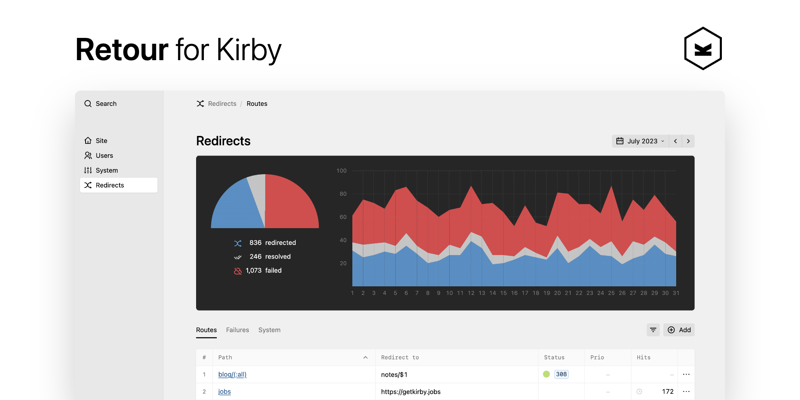
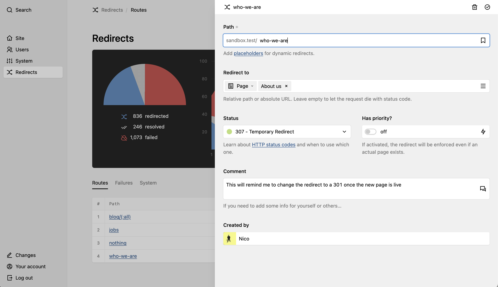

[](https://github.com/distantnative/retour-for-kirby/releases)
[](https://getkirby.com/)
[](https://paypal.me/distantnative)

> [!NOTE]
> Add and manage redirects based on rules, supporting wildcards and HTTP status codes. Track requests to your site that end up nowhere. All directly from the Panel in a familiar UI without writing any code.

## Getting started

Retour 5 requires Kirby 4. For Kirby 3, you can use [v4.4.2](https://github.com/distantnative/retour-for-kirby/releases/tag/4.4.2) (although without further support). 

### Installation

There are two main ways to install this plugin:

1. [Download](https://github.com/distantnative/retour-for-kirby/archive/main.zip), unzip and copy this repository to `/site/plugins/retour`.
2. Alternatively, you can install it with composer:
```bash
composer require distantnative/retour-for-kirby
```

### Updates
1. Make backups of the redirects config (`/site/config/retour.yml`) and database (`/site/logs/retour/log.sqlite`).
2. Replace the `/site/plugins/retour` folder with the new version. Make sure to read the release notes for breaking changes.

Or, if you installed the plugin via composer, run:

```bash
composer update distantnative/retour-for-kirby
```


## Manage your redirects: `Routes` tab

### Add/edit a redirect
To create a new redirect, click on the `Add` button above the table. A drawer opens in which you can enter all the required details. By clicking on any table row or selecting the dropdown option, you can edit an existing route - or delete it: 



#### Path
The URL segment after your site's domain, which you would like to catch and redirect.  
It can be a static path, e.g. `team`, or you can use placeholders to define dynamic redirects, e.g. `blog/(:all)`.  
Dynamic redirects use [Kirby's route patterns](https://getkirby.com/docs/guide/routing#patterns) as placholder.

#### Redirect to
Choose the target of your redirect. There are several options what to enter in this field:

| Select | Value |
|-|-|
| Url | URL to an external website (e.g. `https://getkirby.com`) |
| Page | Choose one of your pages via the link picker |
| Custom | Relative path inside your site (e.g. `blog/2018/a-nice-story`) |
| Custom | `error` to return the site's error page |
| Custom | Leave empty to let the browser request fail (for HTTP status codes not in the `3xx` range) |

If you are using placeholders in your path, you can use the matched value here as well via `$1`, `$2`, ...

```
project/(:any)/photos  =>  project/$1/gallery
blog/(:any)/(:all)     =>  notes/$1/entries/$2
```

#### Status
The [HTTP status code](https://httpstatuses.com/) the redirect will respond with.

- Only status codes in the `3xx` range will actually redirect the request to the new location (URL in browser actually changes).
- All other status code options either return the target page at the specified path (URL stays the same); or the browser request fails with the selected HTTP status code (empty `Redirect to` field).
- If you select the `disabled` option, the redirect is ignored/inactive.

#### Has priority
If the priority flag is activated, the redirect route will overrule any existing pages as well. With this option deactivated, only non-existing paths can be redirected.

#### Comment
A simple text field to leave notes for yourself and others, e.g. why this redirect is necessary.

#### Created by
Retour automatically adds the current user as context information, e.g. when working in a team.

### Sort and filter
By clicking on the table headers you can change the sorting of the routes table, to get a better overview of your existing routes. Via a button above the table - next to the `Add` button - you can also toggle the search input which will allow you to filter the table rows by your search term.


## Monitor what ended nowhere: `Failures` tab
Retour allows you to track requests to your site that Kirby didn't serve, e.g. as the requested page does not exist. This is valuable information for you to know where something might not be working correctly. You can see where your users fail.

### Selected timespan
When you open up Retour, you will be shown the data of the current month. The selected timespan not only applies to the stats graphs, but also the data displayed in the tables. This is particularly relevant for the failures as only those that occured during the selected timespan are shown. But it also applies to the count column in the redirects tab or the overall numbers in the system tab.

You can change the selected timespan by using the navigation bar: moving between previous and next month or even changing the span to a full year, a day or any custom interval:


### Add as redirect
Every table row offers the option (behind the three dots to the right) to create a new redirect based on the failed request, which will be pre-filled with the path to prevent any more failures in the future.

Once you save that new route, all failure entries for that path will also be marked as resolved in the stats.

### Clearing logs
Depending on your use case, you might want to clear the logs from time to time. This can be either done manually by clicking the button above the failures table:


Or automatically via the `distantnative.retour.deleteAfter` option.

## Options
### Config
The following config options are available:

```php
// site/config/config.php

'distantnative.retour' => [
  // En-/disable all logging (true/false)
  'logs' => true,

  // Array of paths to ignore as failures (can include placeholder wildcards or regular expressions)
  'ignore' => [],

  // Number of months after which logs should be deleted automatically
  'deleteAfter' => false,

  // Absolut path for location of redirects config
  // Default: site/config/retour.yml
  // (allows for yml and json files/formats)
  'config' => ...,

  // Absolut path for location of database
  // Default: $kirby->root('logs) + /retour/log.sqlite
  'database' => ...,
  
  // set your own string as prefix in the Panel dialog
  // (disable completely by setting to `false`)
  'site' => 'my.short.domain'
]
```

### Permissions
Moreover, Retour obeys to the following user blueprint permissions:

```yaml
title: Editor

permissions:
 access:
   retour: false
```

## Translations
Retour has been translated into some more languages, thanks to the following contributors:

- English
- German
- French: [sylvainjule](https://github.com/sylvainjule)
- Brazilian Portuguese: [pedroborges](https://github.com/pedroborges)
- Turkish: [afbora](https://github.com/afbora)

## Troubleshooting
This plugin is provided "as is" with no guarantees. Use it at your own risk and always test it yourself before using it in a production environment. If you encounter any problem, please [create an issue](https://github.com/distantnative/retour-for-kirby/issues).

### PDOException: could not find driver
If you encounter this error message, it most likely means that SQLite is not installed, as mentioned in [this issue](https://github.com/distantnative/retour-for-kirby/issues/160) (with example how to fix).

## Pay it forward 💛
This plugin is completely free and published under the MIT license. However, development needs time and effort. If you are using it in a commercial project or just want to support me to keep this plugin alive, please [make a donation of your choice](https://paypal.me/distantnative).
