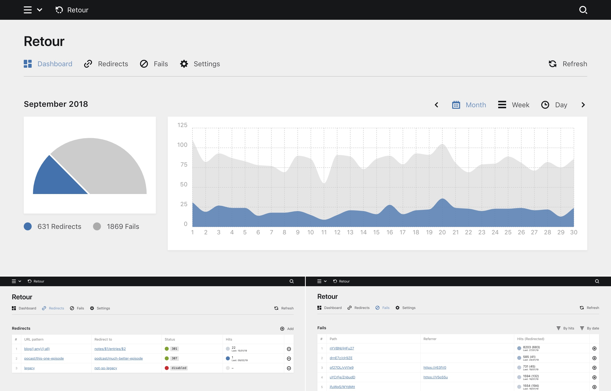

# Retour for Kirby

[](https://github.com/distantnative/retour-for-kirby/releases)
[](https://getkirby.com/news/releases)
[](https://opensource.org/licenses/MIT)
[](https://paypal.me/distantnative)

Plugin for [Kirby 3](https://getkirby.com) which adds a Panel view where you can manage redirects for your website. Redirects feature pattern placeholders, support for most common HTTP status codes as well as 404 tracking. Make sure to take your visitors where they are heading.



## Commercial usage and support development 💛

The Retour for Kirby plugin is free and under the MIT license. If you use it in a commercial project or you want to support its development in general, please consider to give back by

- keeping me healthy with [buying me a juice](https://buymeacoff.ee/distantnative) 🥤 or
- supporting my trips with [a donation of your choice](https://paypal.me/distantnative) 🌍 or
- buying a Kirby license using [this affiliate link](https://a.paddle.com/v2/click/1129/35921?link=1170) ⭐️


## Installation

### Download

[Download](https://github.com/distantnative/retour-for-kirby/archive/master.zip), unzip and copy this repository to `/site/plugins/retour`.

### Git submodule

```
git submodule add https://github.com/distantnative/retour-for-kirby.git site/plugins/retour
```

### Composer

```
composer require distantnative/retour-for-kirby
```

## Redirects

### URL pattern
Path to catch via the plugin and redirect. Can use routing patterns, e.g. `(:any)` or `(:all)`, [learn more](https://getkirby.com/docs/reference/router/patterns).

### Redirect to
Four options:
- Relative path inside your own site (e.g. `blog/2018/a-nice-story`)
- URL of external website (e.g. `https://getkirby.com`)
- `error` to return your site's error page
- empty to let the browser request fail (for status codes not in the `3xx` range)

If you use routing patterns, the mathed parts can be used via numbered variables (`$1`, `$2`...): e.g. `project/$1/gallery`

### Status
Status codes in the `3xx` range will actually redirect the request to the new location (URL changes). All other HTTP status codes have the option to return a specified page with the selected HTTP status code (while the URL stays the same) or let the browser request fail with the selected HTTP status code (if you leave the `Redirect to` field empty).

**Color of the status bubbles**
-  Redirects (`300`-`399`)
-  Other HTTP status codes
-  `disabled`

**HTTP status codes**  
https://httpstatuses.com

## Tracking

Retour tries to track the times it redirects visitors as well as the times visitors try to visit a page on your site that does not exist (typically when they get a `404` error or your site's error page shown).

To maintain privacy and collect the least data necessary, Reroute does not log any personal data of the visitor (no IP etc.). Only the target URL, the referrer and the time are stored in an agregated way.

The tracked hits are displayed in the Panel with a blue status bublle, indicating whether a redirect route or `404` path has been visited  recently or  not so recently.

## Options

```php
return [
  'distantnative.retour.limit' => 10 // # of entries to show per page
];
```

## Disclaimer

This plugin is provided "as is" with no guarantee. Use it at your own risk and always test it yourself before using it in a production environment. If you encounter any problem, please [create an issue](https://github.com/distantnative/retour-for-kirby/issues/new).

## License

[MIT](https://opensource.org/licenses/MIT)

It is discouraged to use this plugin in any project that promotes racism, sexism, homophobia, animal abuse, violence or any other form of hate speech.


