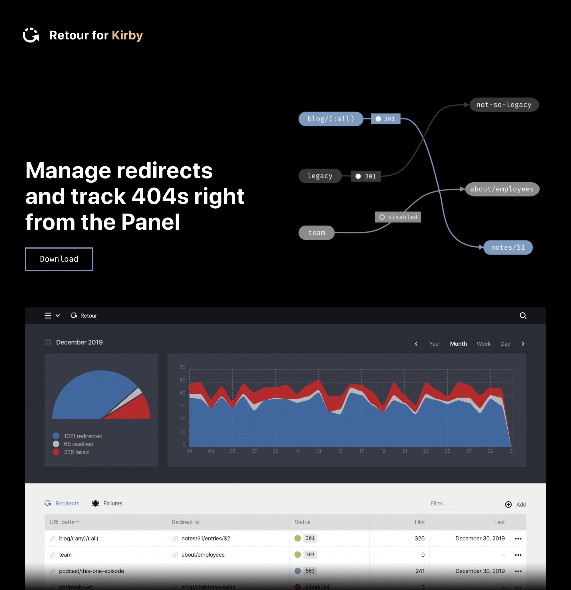

## Retour for Kirby

**Redirects. Made simple.**  
Manage redirects for your site right from the Panel.  
Use placeholders and deliver the HTTP status code of your choice.  
All in a familiar UI without any code to write.  

**Learn more [about the plugin](https://distantnative.com/retour) and read the [documentation](https://distantnative.com/retour/docs).**
