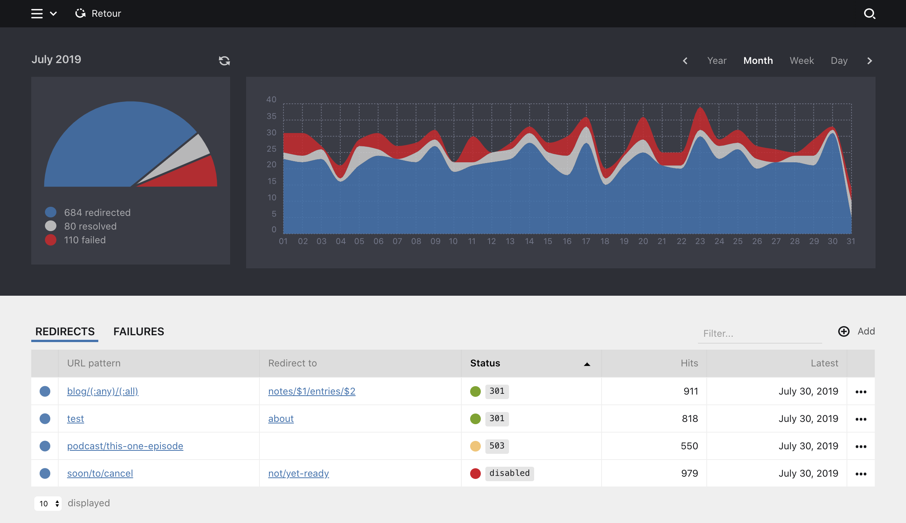

# Retour for Kirby

[](https://github.com/distantnative/retour-for-kirby/releases)
[](https://getkirby.com/)
[](https://opensource.org/licenses/MIT)
[](https://paypal.me/distantnative/15EUR)

Add a Panel view where you can manage advanced redirections and error tracking based on rules supporting wildcards and HTTP status codes. Make sure to take your visitors where they are heading.



> This plugin is completely free and published under the MIT license. However, if you are using it in a commercial project and want to help me keep up with maintenance, please consider making [a donation of your choice](https://paypal.me/distantnative/15EUR),  purchasing your Kirby license(s) through my [affiliate link](https://a.paddle.com/v2/click/1129/35921?link=1170), or [sponsoring me on a monthly basis](https://github.com/sponsors/distantnative).

## Installation

[Download](https://github.com/distantnative/retour-for-kirby/archive/master.zip), unzip and copy this repository to `/site/plugins/retour`.

Alternatively, you can install it with composer:
```bash
composer require distantnative/retour-for-kirby
```

## What is it about?

### Redirects

**URL pattern**
Path to catch via the plugin and redirect. Can use routing patterns, e.g. `(:any)` or `(:all)`, [learn more](https://getkirby.com/docs/reference/router/patterns).

Please notice that you can only create redirects for paths where no actual page exists. Existing pages or routes will always overrule redirects set up in Retour.

**Redirect to**
Four options:
- Relative path inside your own site (e.g. `blog/2018/a-nice-story`)
- URL of external website (e.g. `https://getkirby.com`)
- `error` to return your site's error page
- empty to let the browser request fail (for status codes not in the `3xx` range)

If you use routing patterns, the matched parts can be used via numbered variables (`$1`, `$2`...): e.g. `project/(:any)/photos` => `project/$1/gallery`.

**Status**
[HTTP status codes](https://httpstatuses.com) in the `3xx` range will actually redirect the request to the new location (URL changes). All other HTTP status codes have the option to return a specified page with the selected HTTP status code (while the URL stays the same) or let the browser request fail with the selected HTTP status code (if you leave the `Redirect to` field empty).

-  Redirects (`300`-`399`)
-  Other HTTP status codes
-  `disabled`

### Options

| Option | Default | Description |
|--|--|--|
| `distantnative.retour.deleteAfter`| `false` | Number of months after which all the tracking log entries should be deleted automatically. Turned off by default |
| `distantnative.retour.config`| `site/config/redirects.yml` | Location of config file |
| `distantnative.retour.database`| `site/logs/retour.sqlite` | Location of database file |

### Permissions

#### Access

```yaml
title: Editor

permissions:
  access:
    retour: false
```

#### Update

```yaml
title: Editor

permissions:
  site:
    update: false
```


## Disclaimer

This plugin is provided "as is" with no guarantee. Use it at your own risk and always test it yourself before using it in a production environment. If you encounter any problem, please [create an issue](https://github.com/distantnative/retour-for-kirby/issues/new).
