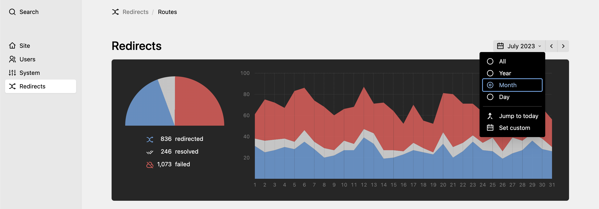
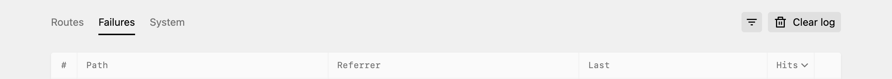

# Monitor what ended nowhere: `Failures` tab

Retour allows you to track requests to your site that Kirby didn't serve, e.g. as the requested page does not exist. This is valuable information for you to know where something might not be working correctly. You can see where your users fail.

## Selected timespan

When you open up Retour, you will be shown the data of the current month. The selected timespan not only applies to the stats graphs, but also the data displayed in the tables. This is particularly relevant for the failures as only those that occured during the selected timespan are shown. But it also applies to the count column in the redirects tab or the overall numbers in the system tab.

You can change the selected timespan by using the navigation bar: moving between previous and next month or even changing the span to a full year, a day or any custom interval:

## Add as redirect

Every table row offers the option (behind the three dots to the right) to create a new redirect based on the failed request, which will be pre-filled with the path to prevent any more failures in the future.

Once you save that new route, all failure entries for that path will also be marked as resolved in the stats.

## Clearing logs

Depending on your use case, you might want to clear the logs from time to time. This can be either done manually by clicking the button above the failures table:

Or automatically via the `distantnative.retour.deleteAfter` option.
